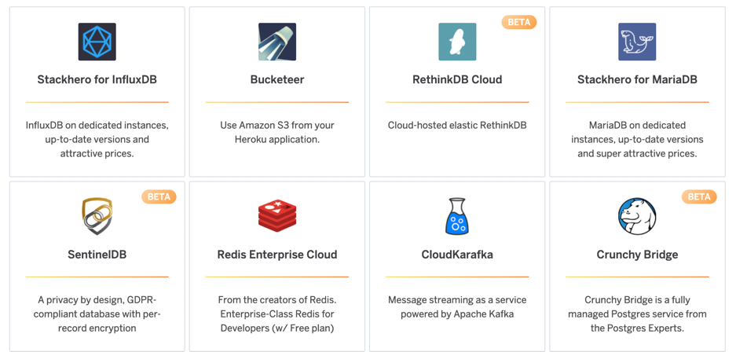

# Heroku Experience

Let's start with a Hello World application deployed on Heroku to see the
experience we're trying to build.

Create a new folder with two files.

Content of `package.json`
```json
{
    "name": "hello-world",
    "version": "1.0.0",
    "description": "Kubecon NA demo",
    "author": "First Last <first.last@example.com>",
    "main": "server.js",
    "scripts": {
      "start": "node server.js"
    }
}
```

You can use the following pattern in your terminal to write to a file with one
command. `Shift+Enter` should help you with new lines.
```bash
cat <<EOF > package.json
{
    "name": "hello-world",
    "version": "1.0.0",
    "description": "Kubecon NA 2022",
    "author": "First Last <first.last@example.com>",
    "main": "server.js",
    "scripts": {
      "start": "node server.js"
    }
}
EOF
```

Content of `server.js`
```javascript
const http = require('http');
const port = process.env.PORT || 8080

const requestListener = function (req, res) {
  res.writeHead(200);
  res.end('Hello World!');
}

const server = http.createServer(requestListener);
server.listen(port);
```

Initialize a git repo in the folder.
```bash
git init
git add .
git commit -s -m "initial commit"
```

Go to https://heroku.com and create a new application. Let's name it
`kubecon-na-2022`. It should give you a command to add a git remote and push
your code.
```bash
heroku git:remote -a kubecon-na-2022
git push heroku main
```

You should see your server up and running when you visit your URL!
```
https://kubecon-na-2022.herokuapp.com/
```

If you want to add cloud infrastructure like a bucket, you need to add an addon
and use the given environment variable in your application. However, you don't
get to have it in your cloud account so how you can configure it is quite limited.



Let's see how we can build it in cloud native way!
