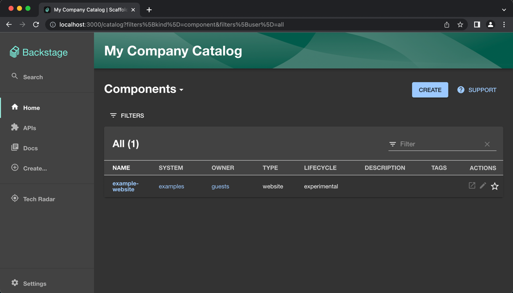
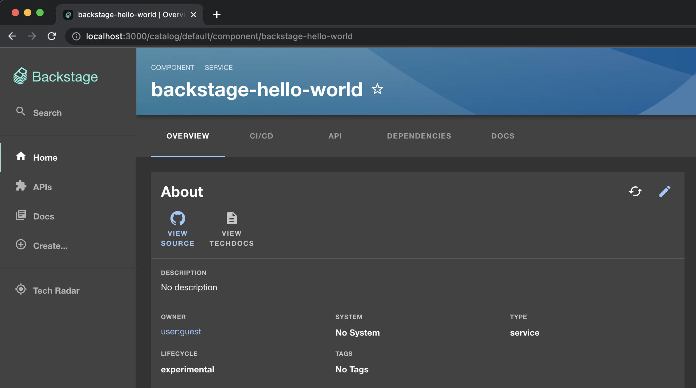
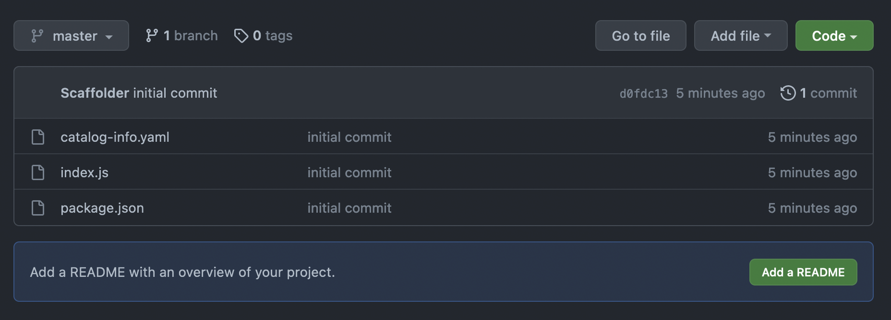

# Installation

In this tutorial, we will:
* Create a new Backstage application.
* Create a new local Kubernetes cluster.
* Install ArgoCD and Crossplane to the cluster.
* Create a GCP Service Account and gave it the necessary permissions to
  create encrypted buckets.
* Configure Crossplane to use the GCP Service Account with minimal permissions.

## Pre-requisites

Backstage:
* `node` v16.17.1 (version proven to be working)
  * MacOS: `brew install node@16 && brew link --overwrite node@16`
* `yarn` v1.22.19 (version proven to be working)
* `docker`
* `git`
* `curl`

Others:
* `kind` to create a local cluster.
* `kubectl`
* `helm`

## Installation

### Kubernetes Cluster

Everything will run in a Kubernetes cluster but we can get away with our own
small local cluster.

```bash
kind create cluster
```

We'll deploy everything into our own namespace:
```bash
kubectl create namespace heroku
```

Point `kubectl` to that namespace so that we don't have to type it every time:
```bash
kubectl config set-context --current --namespace heroku
```

### Backstage

First, we need to create a Backstage application.
```bash
# It will ask the name of the folder it will store the app.
npx @backstage/create-app
```

Run!
```bash
# cd into your application folder first.
yarn dev
```



#### Github Integration

Github Apps is the best way to integrate with GitHub and will let you use Github
users in your auth story but it's a bit cumbersome. So, we will just give a
personal access token to Backstage and it will use that token for all of its
Github operations.

1. Create a token in https://github.com/settings/tokens/new with all `repo` and
   `workflow` permissions.
    ```bash
    # First stop running `yarn dev` command with Ctrl+C
    export GITHUB_TOKEN=ghp_XXX
    ```
2. Make sure the following section exists in `app-config.yaml` file:
    ```yaml
    integrations:
      github:
        - host: github.com
          token: ${GITHUB_TOKEN} # This env var should be available.
    ```
3. Start the Backstage app again.
    ```bash
    yarn dev
    ```

To make sure everything is tight, go to `http://localhost:3000/create` and
create a new component by using Node.js hello world template.





#### Deploy to Cluster

We need to build an image of our Backstage app and deploy it in our cluster.
Note that we will still use the in-memory sqlite database for brevity in this
tutorial, so every restart of the Backstage app will get us back to scratch.

We'd like to use in-memory sqlite for brevity and we need to enable template
importing, so your **full** `app-config.production.yaml`, which is used by 
`yarn build` should look like the following:
```yaml
# The FULL content of app-config.production.yaml in your backstage project.
app:
  baseUrl: http://127.0.0.1:7007

backend:
  baseUrl: http://127.0.0.1:7007
  listen:
    port: 7007
    host: 0.0.0.0

  database:
    # OK for tutorial, not OK for production.
    client: better-sqlite3
    connection: ':memory:'

catalog:
  rules:
    # We added Template to the original list so that we can add templates via the UI.
    - allow: [Component, System, API, Resource, Location, Template]
```

Build the app to produce an artifact.
```bash
# This will save artifacts to packages/*/dist folders.
yarn build
```

Use that artifact to create an image.
```bash
# This will take artifacts from packages/*/dist folders and install them
# in the image.
yarn build-image --tag muvaf/backstage-demo:v0.1.0
```

Load the image into our `kind` cluster so that it can be used in a `Pod` without
having to access an external image registry.
```bash
# Pre-load the image so that we don't have to push to a registry and pull back.
kind load docker-image muvaf/backstage-demo:v0.1.0
```

Now the image is in the cluster and ready to be deployed. Let's create the
Kubernetes manifests. Firstly, you need to create a `Secret` that holds our
Github personal access token.

```bash
# You need to run this command in the terminal you exported GITHUB_TOKEN variable.
cat <<EOF | kubectl apply -f -
apiVersion: v1
kind: Secret
metadata:
  name: backstage-github-token
  namespace: heroku
type: Opaque
stringData:
  GITHUB_TOKEN: ${GITHUB_TOKEN}
EOF
```

Now, let's deploy our Backstage app!
```yaml
# cat <<EOF | kubectl apply -f - (then Shift+Enter, paste the content, Shift+Enter, EOF, Enter)
apiVersion: v1
kind: Service
metadata:
  name: backstage
  namespace: heroku
spec:
  selector:
    app: backstage
  ports:
    - name: http
      port: 80
      targetPort: http
---
apiVersion: apps/v1
kind: Deployment
metadata:
  name: backstage
  namespace: heroku
spec:
  replicas: 1
  selector:
    matchLabels:
      app: backstage
  template:
    metadata:
      labels:
        app: backstage
    spec:
      serviceAccountName: backstage
      containers:
        - name: backstage
          image: muvaf/backstage-demo:v0.1.0
          imagePullPolicy: Never
          ports:
            - name: http
              containerPort: 7007
          env:
            - name: GITHUB_TOKEN
              valueFrom:
                secretKeyRef:
                  name: backstage-github-token
                  key: GITHUB_TOKEN
                  optional: false
            - name: POD_NAMESPACE
              valueFrom:
                fieldRef:
                  fieldPath: metadata.namespace
---
apiVersion: v1
kind: ServiceAccount
metadata:
  name: backstage
  namespace: heroku
```

Access the service from your local machine to make sure everything is tight!
```bash
kubectl port-forward --namespace=heroku svc/backstage 7007:80
```

The `ServiceAccount` will be necessary in the next steps to allow Backstage to
create objects in our cluster.

### ArgoCD

Backstage will create application instances whose code will live in a Git repo,
which means its Kubernetes manifests will live there as well. ArgoCD will
continuously sync those manifests to the application cluster.

Install ArgoCD to our cluster:
```bash
# kubectl is not able to change ServiceAccount namespace given in
# ClusterRoleBinding so we have to replace it with sed.
kubectl create -n heroku -f https://raw.githubusercontent.com/argoproj/argo-cd/stable/manifests/install.yaml --dry-run -o yaml | \
  sed 's/namespace: argocd/namespace: heroku/g' | \
  sed 's/imagePullPolicy: Always/imagePullPolicy: IfNotPresent/g' | \
  kubectl apply -f -
```

Wait for pods to become ready for admin password to be generated:
```bash
kubectl -n heroku get pods -w
```

Call the following to get the initial `admin` password **after** the ArgoCD pods
get ready:
```bash
kubectl -n heroku get secret argocd-initial-admin-secret -o jsonpath='{.data.password}' | base64 -d; echo
```

Access ArgoCD UI with the following command:
```bash
kubectl port-forward svc/argocd-server -n heroku 9090:443
```

### Crossplane

We will use Crossplane to meet the infrastructure needs of our applications.

```bash
helm install crossplane --namespace heroku crossplane-stable/crossplane --wait
```

We are going to provision cloud infrastructure from Google Cloud. We need to
install a Crossplane provider to do that.

```yaml
# cat <<EOF | kubectl apply -f - (then Shift+Enter, paste the content, Shift+Enter, EOF, Enter)
apiVersion: pkg.crossplane.io/v1
kind: Provider
metadata:
  name: provider-gcp
spec:
  package: xpkg.upbound.io/upbound/provider-gcp:v0.16.0
```

Wait till the provider pod comes up.
```
kubectl get pods -w
```

Next, we need to add our cloud credentials for GCP provider to use. The
following is the minimum permission definition that is required to create an
encrypted bucket. We can create a new GCP Role with that file to be assigned
to a GCP Service Account to be used by Crossplane.

Let's write this to a file named `permissions.yaml`.
```yaml
# cat <<EOF > permissions.yaml (then Shift+Enter, paste the content, Shift+Enter, EOF, Enter)
title: "Encrypted Bucket"
description: "Permissions necessary to create an encrypted bucket."
stage: "ALPHA"
includedPermissions:
- storage.buckets.create
- storage.buckets.createTagBinding
- storage.buckets.delete
- storage.buckets.deleteTagBinding
- storage.buckets.get
- storage.buckets.getIamPolicy
- storage.buckets.setIamPolicy
- storage.buckets.update
- storage.objects.list
- storage.objects.delete
- iam.serviceAccounts.create
- iam.serviceAccounts.delete
- iam.serviceAccounts.get
- iam.serviceAccounts.update
- iam.serviceAccountKeys.create
- iam.serviceAccountKeys.delete
- iam.serviceAccountKeys.get
- cloudkms.keyRings.create
- cloudkms.keyRings.createTagBinding
- cloudkms.keyRings.deleteTagBinding
- cloudkms.keyRings.get
- cloudkms.cryptoKeys.create
- cloudkms.cryptoKeys.get
- cloudkms.cryptoKeys.getIamPolicy
- cloudkms.cryptoKeys.setIamPolicy
- cloudkms.cryptoKeys.update
- cloudkms.cryptoKeyVersions.list
- cloudkms.cryptoKeyVersions.destroy
```

Create a new GCP Role with the above permissions:
```bash
export GCP_PROJECT_ID="my-project-name"
gcloud iam roles create encrypted_bucket --project="${GCP_PROJECT_ID}" \
  --file=permissions.yaml
```

Create a GCP Service Account and assign this new role:
```bash
gcloud iam service-accounts create cloud-native-heroku-sa \
  --description="To be used in Cloud Cative Heroku" \
  --display-name="Cloud Native Heroku SA"
```
```bash
# Assumes GCP_PROJECT_ID is available
gcloud projects add-iam-policy-binding "${GCP_PROJECT_ID}" \
  --member="serviceAccount:cloud-native-heroku-sa@${GCP_PROJECT_ID}.iam.gserviceaccount.com" \
  --role="projects/${GCP_PROJECT_ID}/roles/encrypted_bucket"
```

Our GCP Service Account is ready. Let's create a private key that we can give to
our GCP Provider to use.
```bash
# Assumes GCP_PROJECT_ID is available
gcloud iam service-accounts keys create /tmp/creds.json \
  --iam-account="cloud-native-heroku-sa@${GCP_PROJECT_ID}.iam.gserviceaccount.com"
```

Create a Kubernetes `Secret` with the credentials.
```bash
kubectl -n heroku create secret generic gcp-creds \
  --from-file=creds=/tmp/creds.json
```

Use it in the configuration of the provider.
```yaml
# cat <<EOF | kubectl apply -f - (then Shift+Enter, paste the content, Shift+Enter, EOF, Enter)
apiVersion: gcp.upbound.io/v1beta1
kind: ProviderConfig
metadata:
  name: default
spec:
  projectID: crossplane-playground
  credentials:
    source: Secret
    secretRef:
      namespace: heroku
      name: gcp-creds
      key: creds
```

Done!

Jump to the [next tutorial](01-hello-world-backstage.md) that will get you
to create a Hello World Backstage application.