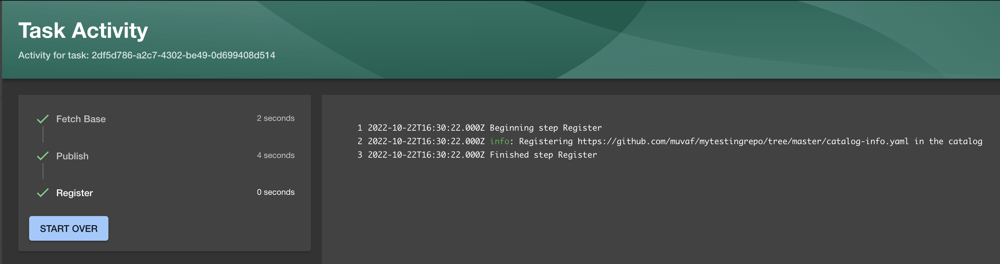

# Hello World Template

Backstage allows you to define software templates together with the code
scaffolding that will be used in the initial commit of the Git repo it creates.
We'll create a hello world template to get a taste of what it does and how.

> You can find the final template for this tutorial in the
> [templates/01-hello-world](templates/01-hello-world) folder.

We can have the templates as part of the Backstage app and when we run `yarn
build` they would be included. But in order to create and add them step by step,
we will create a Github repository for Backstage to pull the templates from.

**Create a new repository in GitHub** called `cloud-native-heroku`. Clone and
initialize the repo with the given commands in the Github UI.

Create a new folder called `templates/01-hello-world`.
```bash
# We are in our new repo, e.g. https://github.com/muvaf/cloud-native-heroku
mkdir -p templates/01-hello-world
```

We'll create the following template object which just creates a repo and
bootstraps it with the content in `skeleton` folder.
```yaml
# Content of templates/01-hello-world/template.yaml
apiVersion: scaffolder.backstage.io/v1beta3
kind: Template
metadata:
  name: hello-world
  title: Hello World
spec:
  owner: muvaf/cloud-native-heroku
  type: service

  parameters:
    - title: Provide metadata
      required:
        - serviceName
        - owner
      properties:
        serviceName:
          title: Service Name
          type: string
          description: Unique name of the component
          ui:field: EntityNamePicker
        owner:
          title: Owner
          type: string
          description: Owner of the component
          ui:field: OwnerPicker
          ui:options:
            allowedKinds:
              - Group
    - title: Choose a location
      required:
        - repoUrl
      properties:
        repoUrl:
          title: Repository Location
          type: string
          ui:field: RepoUrlPicker
          ui:options:
            allowedHosts:
              - github.com

  steps:
    - id: fetch-base
      name: Fetch Base
      action: fetch:template
      input:
        url: ./skeleton
        values:
          serviceName: ${{ parameters.serviceName }}
          owner: ${{ parameters.owner }}
          githubRepositoryOrg: ${{ (parameters.repoUrl | parseRepoUrl).owner }}
          githubRepositoryName: ${{ (parameters.repoUrl | parseRepoUrl).repo }}

    - id: publish
      name: Publish
      action: publish:github
      input:
        allowedHosts: ['github.com']
        description: This is ${{ parameters.serviceName }}
        repoUrl: ${{ parameters.repoUrl }}
        repoVisibility: public
        defaultBranch: main
        protectDefaultBranch: false
        requireCodeOwnerReviews: false

    - id: register
      name: Register
      action: catalog:register
      input:
        repoContentsUrl: ${{ steps.publish.output.repoContentsUrl }}
        catalogInfoPath: '/catalog-info.yaml'
```

In `skeleton` folder, we'll have our very simple hello world application.
```bash
mkdir -p templates/01-hello-world/skeleton
```

A `server.js` and `package.json` is all we need for NodeJS to work. A 
`catalog-info.yaml` for Backstage to identify the application will be there.
```yaml
# Content of templates/01-hello-world/skeleton/catalog-info.yaml
apiVersion: backstage.io/v1alpha1
kind: Component
metadata:
  name: ${{values.serviceName | dump}}
spec:
  type: service
  lifecycle: experimental
  owner: ${{values.owner | dump}}
```
Content of `templates/01-hello-world/skeleton/package.json`
```json
{
  "name": "hello-world",
  "version": "1.0.0",
  "description": "Kubecon NA 2022 - Cloud Native Heroku",
  "author": "First Last <first.last@example.com>",
  "main": "server.js",
  "scripts": {
    "start": "node server.js"
  }
}
```
Content of `templates/01-hello-world/skeleton/server.js`
```javascript
const http = require('http');
const port = process.env.PORT || 8080

const requestListener = function (req, res) {
  res.writeHead(200);
  res.end('Hello World! My name is ${{ values.serviceName }} and my owner is ${{ values.owner }}');
}

const server = http.createServer(requestListener);
server.listen(port);
```

Now let's create a commit and push it to our Git repo.

```bash
git add .
git commit -m "templates: add 01-hello-world"
git push -u origin main
```

Visit `http://127.0.0.1:7007/catalog-import` and supply the path of
`template.yaml` in your Git repo. For example:
```
https://github.com/muvaf/cloud-native-heroku/blob/main/templates/01-hello-world/template.yaml
```

When you click `Create...` on the side bar now, you'll see that there is a new
template called `Bootstrap Nodejs Repo`. Go ahead and choose it to bootstrap a
new repo.

**This will create a new repo in your Github account** with the name you provided.



Clone this new repository and give it a try!
```bash
git clone https://github.com/muvaf/muvaftesting.git
cd muvaftesting
```
```bash
npm start
```

If you see a page in http://127.0.0.1:8080 , congrats! 🎉

# Recap

In this tutorial:
* Created a new Backstage Template.
* Created a new Github repository for Backstage to pull the templates from.
* Used Backstage to bootstrap a new service with its own repository.
* Run the service locally.

In the next steps, we will work build on top of this template and add more
capabilities!
