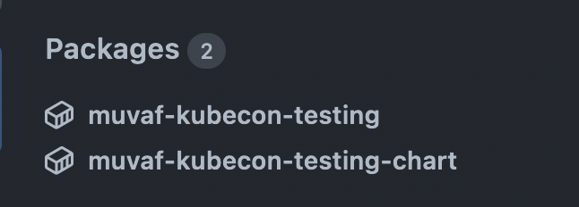

# Add Image and Helm Chart

In this template we will add image building capabilities and a Helm chart that
can be deployed to a cluster to deploy our application.

Copy the earlier template to make changes.
```bash
cp -a templates/01-hello-world templates/02-image-and-chart
```

Change the `metadata` of `template.yaml`
```yaml
metadata:
  name: hello-world-on-kubernetes
  title: Hello World on Kubernetes
```

Create a `Dockerfile` for our image.
```dockerfile
# Content of templates/01-hello-world/skeleton/Dockerfile
FROM node:16-alpine

WORKDIR /usr/src/app

COPY package*.json ./
RUN npm install

COPY server.js .
CMD [ "node", "server.js" ]
```

Let's give it a try to make sure it's all tight.
```bash
docker build --tag hello:v0.1.0 .
```
```bash
docker run -p 8080:8080 hello:v0.1.0
```

If you see the page at http://127.0.0.1:8080, congrats! 🎉

Let's move on to adding a Helm chart.
```bash
mkdir -p templates/02-image-and-chart/skeleton/chart
```
It will have chart metadata and basic `Deployment` and `Service` definitions.
```bash
mkdir -p templates/02-image-and-chart/skeleton/chart/templates
```

As you will notice, we need to use `` to open and `` to
close what Backstage shouldn't touch so that Helm templates are not considered.
```yaml
# Content of templates/02-image-and-chart/skeleton/chart/Chart.yaml
apiVersion: v2
name: ${{ values.githubRepositoryName }}-chart
description: A Helm chart for ${{ values.serviceName }} owned by ${{ values.owner }}
type: application
version: 0.1.0
appVersion: "1.16.0"
```
```yaml
# Content of templates/02-image-and-chart/skeleton/chart/values.yaml
image:
  # To be replaced in-place before publishing or installation.
  tag: "%%TAG%%"
```
```yaml
# Content of templates/02-image-and-chart/skeleton/chart/templates/service.yaml
apiVersion: v1
kind: Service
metadata:
  name: hello-world
spec:
  selector:
    app: hello-world
  ports:
    - name: http
      port: 80
      targetPort: http
---
apiVersion: apps/v1
kind: Deployment
metadata:
  name: hello-world
spec:
  replicas: 1
  selector:
    matchLabels:
      app: hello-world
  template:
    metadata:
      labels:
        app: hello-world
    spec:
      containers:
        - name: hello-world
          image: ghcr.io/${{ values.githubRepositoryOrg }}/${{ values.githubRepositoryName }}:{{ .Values.image.tag }}
          ports:
            - name: http
```

Now we will add a `.github` folder that will contain Github Actions workflow
to build the image and Helm chart as OCI image, and then push both to Github
Container Registry (GHCR). 

Create the following file in `.github/workflows/ci.yaml`
```bash
mkdir -p templates/02-image-and-chart/.github/workflows
```
```yaml
# Content of templates/02-image-and-chart/skeleton/.github/workflows/ci.yaml

name: Continuous Integration

on:
  push:
    branches: ['main']

jobs:
  ci:
    runs-on: ubuntu-20.04
    permissions:
      contents: read
      packages: write

    steps:
      - name: Checkout repository
        uses: actions/checkout@v3

      - name: Setup QEMU
        uses: docker/setup-qemu-action@v1
        with:
          platforms: arm64

      - name: Setup Docker Buildx
        id: buildx
        uses: docker/setup-buildx-action@v2

      - name: Log in to Github Container Registry
        uses: docker/login-action@v2
        with:
          registry: ghcr.io
          username: ${{ github.actor }}
          password: ${{ secrets.GITHUB_TOKEN }}

      - name: Extract metadata (tags, labels) for Docker
        id: meta
        uses: docker/metadata-action@v4
        with:
          images: ghcr.io/${{ github.repository }}

      - name: Build and push Docker image
        id: build-push
        uses: docker/build-push-action@v3
        with:
          builder: ${{ steps.buildx.outputs.name }}
          context: .
          push: true
          tags: ghcr.io/${{ github.repository }}:${{ github.sha }}
          labels: ${{ steps.meta.outputs.labels }}
          platforms: linux/amd64,linux/arm64
      
      - name: Update the image tag in Helm chart
        env:
          IMAGE_TAG: ${{ github.sha }}
        run: sed -i "s|%%TAG%%|${IMAGE_TAG}|g" chart/values.yaml

      - name: Install Helm
        uses: azure/setup-helm@v3
        with:
          version: 'v3.10.0'

      - name: Publish Helm chart to GHCR
        env:
          IMAGE_BASE_URL: ghcr.io/${{ github.repository_owner }}
        run: |
          helm package chart --version 9.9.9
          helm push $(find . -iname '*-chart-9.9.9.tgz') oci://${IMAGE_BASE_URL}

```

Once all done, create a new commit and push it.

Add our new template to Backstage in http://127.0.0.1:7007/catalog-import
by providing the path to our new `template.yaml` file in Github.
```
https://github.com/muvaf/cloud-native-heroku/blob/main/templates/02-image-and-chart/template.yaml
```

Go back to creation page and try out our new software template. Once Backstage
is done, you should see a Github Action your repo running and it will result in
two container images pushed.



Well, let's give it a try!

Click on the chart package and get the full image path to install with Helm.
```bash
helm -n testing install helloworld oci://ghcr.io/muvaf/muvaf-kubecon-testing-chart --version 9.9.9 --create-namespace --wait
```
```bash
kubectl get pods -n testing
kubectl get services -n testing
```
```bash
kubectl port-forward --namespace=testing svc/hello-world 9090:80
```

If you see the usual page, congrats! 🎉

Clean up.
```bash
kubectl delete namespace testing
```