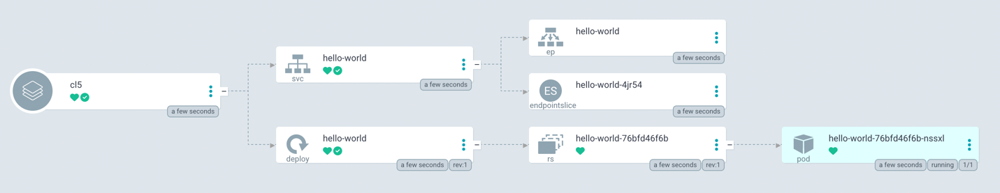

# Continuous Deployment with ArgoCD

We would like to deploy our application immediately after the repo is created.
We will set up ArgoCD to deploy our Helm chart.

> Refresh of the application at every commit is WIP since it is not much inline
> with Kubernetes conventions.

In this tutorial, we will:
* Created a custom action that creates an ArgoCD Application and blocks Backstage
  until the application and chart images are pushed to the registry.
* Used the custom action in a template to create a new service that is deployed
  to the cluster.

> You can find the final template for this tutorial in the
> [templates/03-argocd](templates/03-argocd) folder.

We need to inform ArgoCD about our Helm chart. We will do that by including a
step in our template that will create an ArgoCD `Application` object in our
cluster.

Copy the earlier template.
```bash
# We are in the template repo, i.e. {your username}/cloud-native-heroku on Github.
cp -a templates/02-image-and-chart templates/03-argocd
```

Change the `metadata` of `template.yaml`
```yaml
# Change for the content in templates/03-argocd/template.yaml
metadata:
  name: hello-world-gitops
  title: Hello World with GitOps
```

At the time of writing, I couldn't find an action to be used to create
Kubernetes manifests. The built-in Kubernetes component is used for read-only
operations. So, we will have to write a [custom action][writing-custom-actions] 
to create an ArgoCD `Application` in the cluster that points to our Helm chart.
In addition, we need to have an action to wait for images to be published before
creating the Helm chart.

Since it may take too long, I wrote that custom action before the tutorial as an
NPM package called [`@muvaf/create-argocd-application`][npm-pkg] that we can add
to our backend package of Backstage app.

Let's stop the `kubectl port-forward` command of Backstage and go back to the
directory of our Backstage application.

```bash
# From your Backstage root directory
yarn add --cwd packages/backend @muvaf/create-argocd-application
# To be able to keep using the built-in actions.
yarn add --cwd packages/backend @backstage/integration
```

We will need to register this new custom action in our backend package.
We'll initialize the built-in actions and just append ours.

The **full content** of `packages/backend/src/plugins/scaffolder.ts` should look
like the following:
```typescript
// The full content of packages/backend/src/plugins/scaffolder.ts
import { CatalogClient } from '@backstage/catalog-client';
import { createRouter, createBuiltinActions } from '@backstage/plugin-scaffolder-backend';
import { ScmIntegrations } from '@backstage/integration';
import { Router } from 'express';
import type { PluginEnvironment } from '../types';
import { argocdCreateHelmApplication, githubWaitLastWorkflow } from "@muvaf/create-argocd-application";

export default async function createPlugin(
  env: PluginEnvironment,
): Promise<Router> {
  const catalogClient = new CatalogClient({ discoveryApi: env.discovery });
  const integrations = ScmIntegrations.fromConfig(env.config);

  const builtInActions = createBuiltinActions({
    integrations,
    catalogClient,
    config: env.config,
    reader: env.reader,
  });

  const actions = [
      ...builtInActions,
      argocdCreateHelmApplication(),
      githubWaitLastWorkflow({ integrations })
  ]

  return await createRouter({
    actions,
    catalogClient,
    logger: env.logger,
    config: env.config,
    database: env.database,
    reader: env.reader,
    identity: env.identity,
  });
}
```

Let's give it a quick try!
```bash
yarn dev
```

Go to `http://localhost:3000/create/actions` and scroll down to the bottom to see
if your new custom action appears. If you see it, congrats! 🎉

You can stop it now with `Ctrl+C`.

Lastly, we need to give permissions to Backstage to create `Application` in our
namespace.
```yaml
# cat <<EOF | kubectl apply -f - (then Shift+Enter, paste the content, Shift+Enter, EOF, Enter)
apiVersion: rbac.authorization.k8s.io/v1
kind: Role
metadata:
  name: argocd-application-manager
  namespace: heroku
rules:
- apiGroups: ["argoproj.io"]
  resources: ["applications"]
  verbs: ["*"]
---
apiVersion: rbac.authorization.k8s.io/v1
kind: RoleBinding
metadata:
  name: backstage-argocd
  namespace: heroku
subjects:
- kind: ServiceAccount
  name: backstage
roleRef:
  kind: Role
  name: argocd-application-manager
  apiGroup: rbac.authorization.k8s.io
```

Since we made a code change, we'll need to re-build our app and deploy it to
cluster.
```bash
# From your Backstage root directory
yarn build
yarn build-image --tag muvaf/backstage-demo:v0.1.0
kind load docker-image muvaf/backstage-demo:v0.1.0
```
Make the cluster re-deploy with our new image.
```bash
kubectl -n heroku get pods
# Find the backstage pod and copy its name.
kubectl -n heroku delete pod BACKSTAGE_POD_NAME
```

Wait till it terminates successfully and the new one is in `Running` state. Then
forward the port again:
```
kubectl port-forward --namespace=heroku svc/backstage 7007:80
```

The custom actions are there but they're not used by any template. We will edit our
template to contain a step that calls our custom actions. Add the following 
**right before the last step whose id is `register`**:
```yaml
# Insertion to templates/03-argocd/template.yaml
    - id: github-wait
      name: Wait for Github Actions to complete
      action: github:wait-last-workflow
      input:
        owner: ${{ (parameters.repoUrl | parseRepoUrl).owner }}
        repo: ${{ (parameters.repoUrl | parseRepoUrl).repo }}
        branch: main
    
    - id: argocd-create
      name: Create ArgoCD Application
      action: argocd:create-helm-application
      input:
        name: ${{ parameters.serviceName }}
        namespace: ${{ parameters.serviceName }}
        chart:
          repo: ghcr.io/${{ (parameters.repoUrl | parseRepoUrl).owner }}
          name: ${{ (parameters.repoUrl | parseRepoUrl).repo }}-chart
          version: 9.9.9
```

Commit your changes.

```bash
git add .
git commit -s -m "templates: add 03-argocd"
git push
```

Add our new template to Backstage in `http://127.0.0.1:7007/catalog-import`
by providing the path to our new `template.yaml` file in Github.
```
https://github.com/muvaf/cloud-native-heroku/blob/main/templates/03-argocd/template.yaml
```

Create a new service using our shiny new `Hello World with ArgoCD` template and
you'll see the following happening:
* Git repo created.
* Image and chart are pushed to GHCR.
* ArgoCD fetches the chart and deploys it to your cluster.
* Your application is accessible!

If all things above happened, congratulate yourself! 🎉



Jump to the [next tutorial](05-crossplane.md) that will show you how to create
your own infrastructure API and use it in your templates so that software instances
can request infrastructure resources like GCP bucket.

[writing-custom-actions]: https://backstage.io/docs/features/software-templates/writing-custom-actions
[npm-pkg]: https://www.npmjs.com/package/@muvaf/create-argocd-application